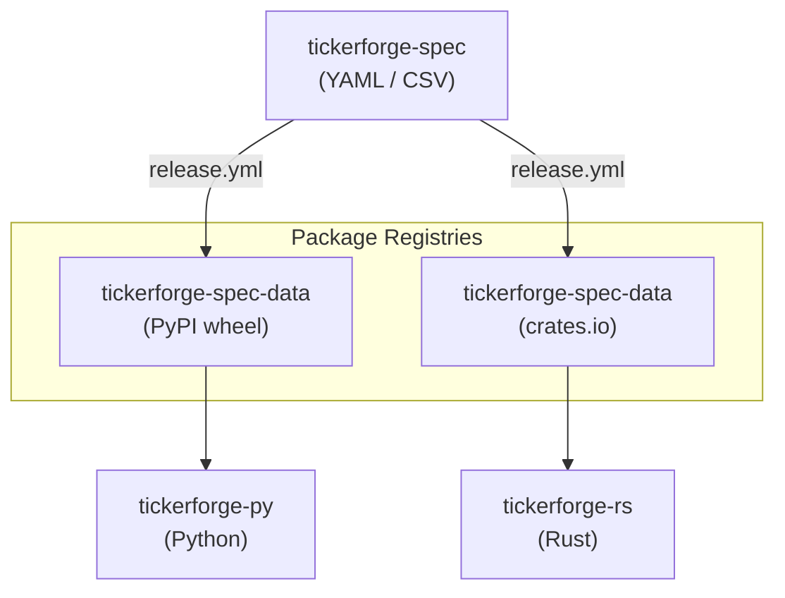

# TickerForge

**Spec-driven derivatives symbol resolution for multiple markets**

[](https://pypi.org/project/tickerforge/)
[](https://crates.io/crates/tickerforge)
[](https://pypi.org/project/tickerforge-spec-data/)
[](https://crates.io/crates/tickerforge-spec-data)
[](LICENSE)

TickerForge generates and parses financial derivative tickers (futures and options) from a shared, canonical YAML specification. The spec covers exchange metadata, contract cycles, expiration rules, and options definitions for every supported market. Adding a new market is as simple as dropping a YAML file into `spec/contracts/` -- no code changes required.

## Ecosystem



The canonical data lives in **tickerforge-spec** and is published as a data package to both PyPI and crates.io on every release. Each language implementation depends on its registry's `tickerforge-spec-data` package at runtime.

## Packages

### tickerforge-spec -- canonical data

[](https://github.com/mesias/tickerforge-spec/actions/workflows/ci.yml)

The source of truth for exchange metadata, futures contract rules, options definitions, expiration rules, trading schedules, and golden-file test cases. All data is expressed in YAML and CSV, with no runtime code.

| Registry | Package | Install |
|----------|---------|---------|
| PyPI | [`tickerforge-spec-data`](https://pypi.org/project/tickerforge-spec-data/) | `pip install tickerforge-spec-data` |
| crates.io | [`tickerforge-spec-data`](https://crates.io/crates/tickerforge-spec-data) | `cargo add tickerforge-spec-data` |

Repository: [github.com/mesias/tickerforge-spec](https://github.com/mesias/tickerforge-spec)

---

### tickerforge-py -- Python implementation

[](https://github.com/mesias/tickerforge-py/actions/workflows/ci.yml)
[](https://codecov.io/gh/mesias/tickerforge-py)
[](https://github.com/mesias/tickerforge-py)

Loads the spec, generates futures tickers, and parses both futures and options tickers back to structured contract information. Uses Pydantic for model validation and `exchange_calendars` for schedule integration.

```bash
pip install tickerforge
```

Repository: [github.com/mesias/tickerforge-py](https://github.com/mesias/tickerforge-py)

---

### tickerforge-rs -- Rust implementation

[](https://github.com/mesias/tickerforge-rs/actions/workflows/ci.yml)
[](https://codecov.io/gh/mesias/tickerforge-rs)
[](https://github.com/mesias/tickerforge-rs)

Loads the spec, generates futures tickers, and provides a unified `parse_any_ticker` API that resolves both futures and options from any supported market. Uses `serde_yaml`, `chrono`, and `bdays` for calendar-aware expiration resolution.

```bash
cargo add tickerforge
```

Repository: [github.com/mesias/tickerforge-rs](https://github.com/mesias/tickerforge-rs)

## Features

Capabilities shared across both implementations:

- **Multi-market futures parsing** -- resolve `INDM26` (B3) and `ESM26` (CME) from the same spec tree
- **Multi-market options parsing** -- equity options (`PETRA30`), index options (`IBOVK26C120000`), dollar options (`DOLK26C5000`), and more
- **Cash Equities** -- explicit definitions for cash assets (e.g. `PETR4`, `VALE3`) including their regular trading sessions, lot multipliers, and aliases.
- **Ticker generation** -- produce the front-month ticker for any contract at a given date
- **Contract-centric API** -- look up tick size, lot size, session times, and exchange timezone for any contract
- **Exchange calendars** -- spec-driven holiday rules (fixed dates, Easter offsets, nth-weekday) with fallback to external calendar providers
- **Expiration resolution** -- nearest-weekday, first/last business day, fixed-day, and schedule-based rules
- **Ambiguity detection** -- when a ticker matches multiple instruments across markets, the parser reports the conflict and supports exchange-level filtering
- **Builder pattern** -- fluent API for configuring the parser with spec path, reference date, and exchange filter

## Supported Markets

| Market | Exchange | Assets |
|--------|----------|--------|
| B3 | Brasil, Bolsa, Balcao | Futures (IND, WIN, DOL, WDO, DI1, DDI, DAP, ...), Options (equity, index, dollar, interest rate), and **Cash Equities** (PETR4, VALE3, ITUB4, BBDC4, ...) |
| CME | Chicago Mercantile Exchange | Futures (ES, NQ, YM, RTY, GC, SI, CL, NG, ZB, ZN, ZF, ZT, 6E, 6J, ...) |

Adding a new market requires only a YAML file under `spec/contracts/<market>/` with the appropriate `futures:` and/or `options:` blocks.

## Repository Structure

See [REPOSITORY_GUIDE.md](REPOSITORY_GUIDE.md) for details on how the repositories are organized, where documentation belongs, and how versioning and releases work.

## License

[MIT](LICENSE)
